# Claivo: Every Claim, Verified

An AI-powered expense auditing system that uses RAG and a deterministic rule engine to automatically cross-reference digital receipts against complex corporate policies for real-time compliance.

---

## Project Demonstration

### Project Demo

A modern audit interface for expense review, policy validation, and decision tracking.

### Screenshots

📸 Example screens

- Claims dashboard overview
- Audit analytics and risk breakdowns
- Receipt review and RAG validation flow

### Demo Video

🎥 A short walkthrough video can demonstrate the claim upload flow, live decision validation, and auditor review experience.

---

## 🎯 The Problem

Manual receipt review is expensive, inconsistent, and difficult to scale. Finance teams face complex policy rules, multiple currencies, and ambiguous line items, which increases the risk of incorrect approvals and hidden spend.

Without a reliable audit process that tracks findings back to source data and policy references, organizations lack transparency and accountability.

---

## 💡 The Solution

Claivo is an expense intelligence platform that converts receipt images into structured, auditable decisions. It combines OCR, retrieval-driven policy validation, and deterministic rules to ensure every approval, flag, or rejection is clear and defensible.

Core philosophy: traceable AI.

Claivo is designed so that every recommendation is supported by evidence:

- Minimized hallucination: audit conclusions are grounded in OCR-extracted receipt data and policy context
- Audit-ready findings: results include rule references, computed math, and rationale
- Verifiable controls: duplicate detection, currency conversion, and grade-based policy validation are explicit and reproducible

---

## Key Features & Technical Implementation

1. Receipt ingestion and OCR
   - Feature: Accept receipt images and PDFs for automated analysis.
   - Implementation:
     - FastAPI handles uploads and API orchestration.
     - Google Cloud Vision extracts receipt text.
     - PyMuPDF converts PDF pages to images for OCR processing.

2. Expense extraction and normalization
   - Feature: Parse merchant, date, amount, currency, and category from raw receipt text.
   - Implementation:
     - `extractor.py` applies regex-based cleaning and date normalization.
     - `normalize_expense_type` categorizes receipts into meals, accommodation, travel, and general spend.

3. Policy retrieval and validation
   - Feature: Retrieve relevant policy sections and validate each claim against corporate rules.
   - Implementation:
     - ChromaDB stores policy embeddings for similarity search.
     - `rag_pipeline.py` constructs audit prompts based on category and employee grade.
     - Responses include exact math and policy references for transparency.

4. Duplicate detection and fraud prevention
   - Feature: Identify visually similar receipts and prevent repeated submissions.
   - Implementation:
     - `imagehash` and Pillow generate perceptual fingerprints.
     - DynamoDB scans detect duplicates by visual hash or matching employee/date/amount combinations.

5. Audit decision scoring
   - Feature: Rank claims by risk to prioritize finance review.
   - Implementation:
     - `calculate_risk_score()` computes risk using decision state, amount, date flags, and policy source.
     - Claims are surfaced by priority in the auditor interface.

6. Frontend workflow
   - Feature: Employee submission portal and auditor dashboard for claim management.
   - Implementation:
     - React Router supports `/submit`, `/admin`, and `/audit/:claim_id` routes.
     - UI includes notifications, search/filtering, history tracking, and export tools.

7. Auditor dashboard and analytics
   - Feature: Real-time claim monitoring with analytics and status breakdowns.
   - Implementation:
     - Recharts drives visual summaries of spend categories and claim status.
     - Bulk actions and risk-sorted review help auditors move quickly.

---

## � Policy Configuration

### Using Your Own Corporate Policy

Claivo requires a corporate expense policy document to validate claims. The repository includes a sample policy PDF (`policy.pdf`) for demonstration purposes only.

**Important:**

- The included `policy.pdf` is a template created for testing and demonstration.
- **You must replace it with your organization's actual expense policy** to run Claivo in production.
- Claivo does NOT enforce policy compliance on your behalf—it validates claims against the policy _you provide_.
- Your organization is responsible for ensuring the policy document complies with local regulations and legal requirements.

### How to Replace the Sample Policy

1. **Prepare your policy document:**
   - Create a PDF containing your organization's expense policy.
   - Ensure it covers approved expense categories, spending limits by employee grade, restricted items, and any geographic variations.

2. **Replace the sample file:**

   ```bash
   cp your_company_policy.pdf backend/policy.pdf
   ```

3. **Re-ingest the policy:**
   - Delete the existing ChromaDB index: `rm -rf backend/chroma_db`
   - Restart the backend to rebuild embeddings from your new policy:
     ```bash
     uvicorn main:app --reload
     ```

4. **Verify:**
   - Test a sample claim to confirm decisions are based on your policy.

### Policy Document Requirements

For best results, your policy should include:

- **Grade-based limits** (e.g., G1–G5 employee levels)
- **Category-specific rules** (meals, travel, accommodation, etc.)
- **Prohibited items** (alcohol, personal wellness, entertainment)
- **Geographic variations** (city-specific meal caps, international per diems)
- **Approval authorities** (who can approve what)

---

## �🛠️ Tech Stack

### Programming Languages

- Python 3.10+ (backend orchestration, OCR, AI pipeline)
- JavaScript (React frontend)

### Frameworks

- FastAPI (backend API server)
- React.js (frontend SPA)
- React Router (frontend navigation)

### Databases & Storage

- DynamoDB (claims persistence and audit metadata)
- AWS S3 (receipt storage)
- ChromaDB (policy retrieval and vector search)

### AI & Third-Party Tools

- Google Cloud Vision API (OCR)
- Groq API (LLM inference and reasoning)
- LangChain (RAG orchestration)
- PyMuPDF (PDF-to-image conversion)
- imagehash + Pillow (visual duplicate detection)
- boto3 (AWS integrations)

---

## 🚀 Setup & Deployment

### 1. Local Development

#### Backend (FastAPI)

```bash
cd backend
python -m venv venv
# Windows
venv\Scripts\activate
# macOS / Linux
# source venv/bin/activate
pip install -r requirements.txt
```

- Ensure `gcp_key.json` is present in the `/backend` folder.
- Configure your local `.env` values for API keys and AWS credentials.

```bash
uvicorn main:app --reload
```

#### Frontend (React)

```bash
cd frontend
npm install
```

- Update your frontend environment or config to point to the local backend API:
  - `REACT_APP_API_URL=http://localhost:8000`

```bash
npm start
```

Open your browser at `http://localhost:3000`.

### 2. Cloud Deployment Configuration

#### Backend (Render)

The backend is live at `https://claivo-backend.onrender.com`.

- Build Command: `pip install -r requirements.txt`
- Start Command: `uvicorn main:app --host 0.0.0.0 --port $PORT`

Set the following environment variables in the Render dashboard:

- `GROQ_API_KEY` — for policy reasoning.
- `EXCHANGE_API_KEY` — for real-time currency conversion.
- `SES_SENDER_EMAIL` — your verified AWS SES identity.
- `AWS_ACCESS_KEY_ID` — for S3 and DynamoDB access.
- `AWS_SECRET_ACCESS_KEY` — for S3 and DynamoDB access.
- `GOOGLE_APPLICATION_CREDENTIALS` — set to the path of your uploaded GCP JSON key.

#### Frontend (AWS Amplify)

The frontend is live at `https://main.d3druktcc8d67a.amplifyapp.com`.

- Build Settings: Amplify is configured to detect the `/frontend` directory.
- Build Command: `npm run build`
- Base Directory: `build`

Set the following environment variable in Amplify:

- `REACT_APP_API_URL=https://claivo-backend.onrender.com`

---

## 📡 API Reference

### Core Endpoints

- `GET /` — health check and service metadata
- `POST /upload` — submit a receipt image and employee claim payload
- `GET /docs` — FastAPI API documentation

---

## 🧠 System Architecture

Claivo integrates a React frontend with a FastAPI backend. Receipt text is extracted using Google Cloud Vision, policy context is retrieved via ChromaDB, and claims are persisted in AWS storage. The application combines rule-based logic, currency normalization, and retrieval-guided validation to deliver auditable expense decisions.

### Architecture Diagram



---

## 🌐 Deployment Architecture

### 🔹 Frontend (React)

- Hosted on AWS Amplify
- Static site hosting with CI/CD
- Connected to a GitHub monorepo
- Build process:
  - Amplify pulls code from the GitHub `main` branch
  - Runs `npm install` and `npm run build`
  - Serves the production bundle from `/frontend/build`
  - Automatically redeploys on every push
- Live URL: `https://main.d3druktcc8d67a.amplifyapp.com/submit`

### 🔹 Backend (FastAPI)

- Hosted on Render
- Server: Uvicorn
- Key capabilities:
  - REST API endpoints including `/upload`, `/claims`, and `/claims/{id}`
  - OCR processing with Google Vision and image conversions
  - RAG-based policy validation
  - Deterministic rule engine for expense compliance
  - AWS SES notifications with frontend toast alerts
- Live URL: `https://claivo-backend.onrender.com`

---

## What’s Next

This repository is ready for expense audit workflows. Future enhancements can include:

- role-based authentication for employees and auditors
- batch receipt ingestion and review
- expanded policy extraction from documents
- advanced analytics and alerting

---

## License

This project is licensed under the MIT License. See the [LICENSE](./LICENSE) file for full details.
